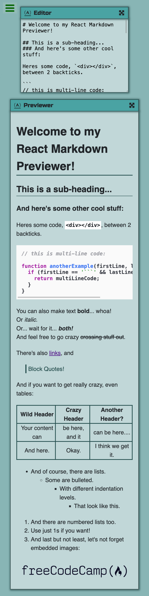
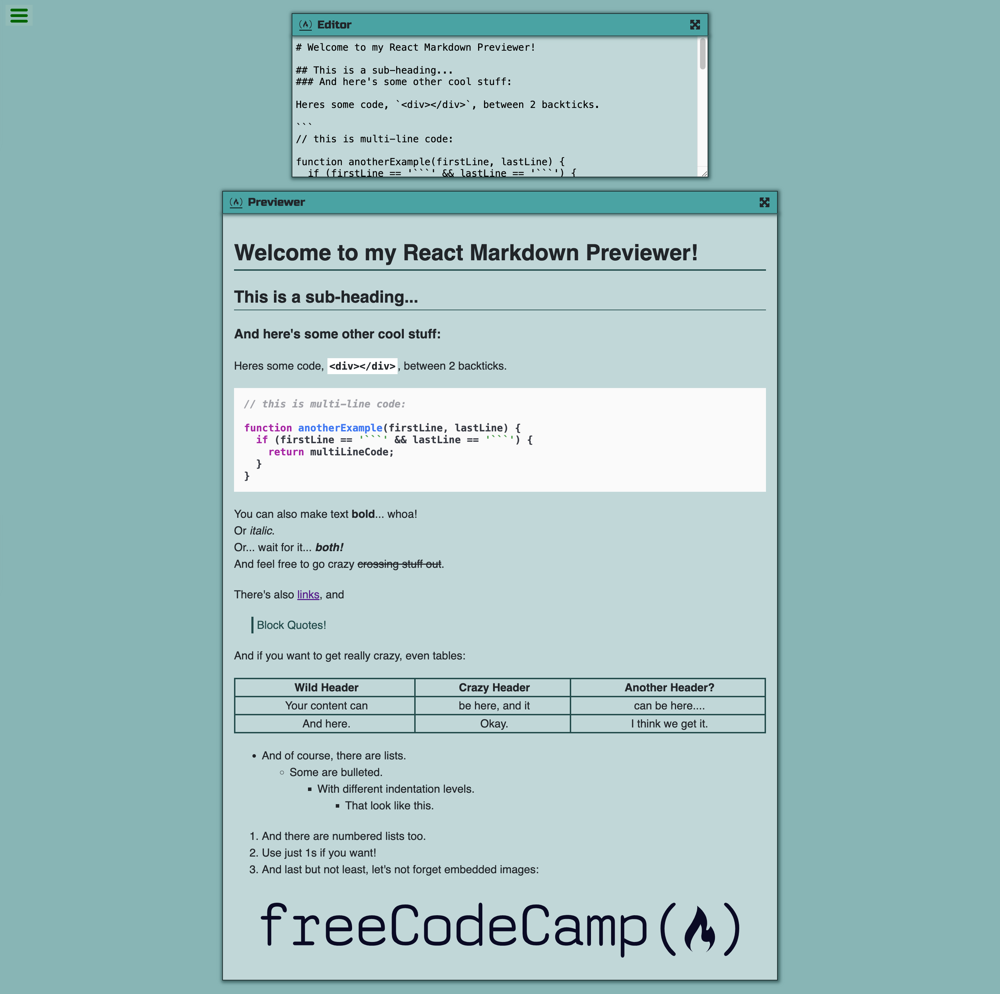

# freeCodeCamp - Build a Markdown Previewer

This is a solution to the [Build a Markdown Previewer challenge on freeCodeCamp](https://www.freecodecamp.org/learn/front-end-development-libraries/front-end-development-libraries-projects/build-a-markdown-previewer).

## Table of contents

- [Overview](#overview)
  - [The challenge](#the-challenge)
  - [Screenshot](#screenshot)
  - [Links](#links)
- [My process](#my-process)
  - [Built with](#built-with)
  - [What I learned](#what-i-learned)
  - [Continued development](#continued-development)
  - [Useful resources](#useful-resources)
- [Author](#author)

## Overview

### The challenge

Users should be able to:

- View the optimal layout for the site depending on their device's screen size
- Edit markdown content in editor
- Preview formatted markdown content in previewer
- Maximize or minimize editor or previewer

### Screenshot

<table>
  <tr>
    <td>
      
    </td>
  </tr>
  <tr>
    <td>
      
    </td>
  </tr>
</table>

### Links

- Live Site URL: [here](https://zun-liang.github.io/fcc-markdown-previewer/)

## My process

### Built with

- HTML
- CSS
- Flexbox
- Mobile-first workflow
- [React](https://reactjs.org/) - JS library
- [Styled Components](https://styled-components.com/) - For styles
- [Vite](https://vitejs.dev/)
- [marked](https://marked.js.org/) - To parse markdown to HTML
- [marked-highlight](https://github.com/markedjs/marked-highlight) - To highlight code blocks
- [highlight.js](https://highlightjs.org/) - To highlight code blocks
- [html-react-parser](https://github.com/remarkablemark/html-react-parser) - To transfer HTML to React components

### What I learned

- How to highlight syntax using third-party libraries in React

  During development, one thing I found challenging was adding highlighting to code blocks in React. The goal was to enable automatic code block highlighting as users typed, a simple feature that we benefit from all the time.

  I am aware that there are several libraries out there to achieve this feature, such as Prism.js, highlight.js, marked-highlight, react-syntax-highlighter, react-highlight and more. I was stuck because their documentations only showcased how to work on fixed code blocks, rather than dynamically highlighting user-input code. Especially that it is recommended to use `marked` for transferring markdown text to HTML as described by this challenge, I wanted to achieve this feature by `marked` as well. I read `marked` documentation and it turns out that they have improved their `options` a lot, and the `highlight` option is replaced by `marked-highlight` now.

  I finally figured this out after an idea came to me that I can do some pre-processing to markdown before it gets parsed to HTML and React components. It is to find the markdown code blocks syntax "```" and add "javascript" after it to make it recognizable by marked-highlight. And now users can type in any code blocks they want and preview the highlighted code blocks at the same time.

### Continued development

- How to automatize table width depending on its contents

  Currently, tables will take over 100% width of the app. This is probably due to the css rules of html-react-parser.

### Helpful Resources

- [overflow-auto](https://developer.mozilla.org/en-US/docs/Web/CSS/overflow#auto)
- [border-collapse](https://developer.mozilla.org/en-US/docs/Web/CSS/border-collapse)
- [RegExp.prototype.exec()](https://developer.mozilla.org/en-US/docs/Web/JavaScript/Reference/Global_Objects/RegExp/exec)
- [Specifying a function as the replacement](https://developer.mozilla.org/en-US/docs/Web/JavaScript/Reference/Global_Objects/String/replace#specifying_a_function_as_the_replacement)

## Author

- Website - [Zun Liang](https://zunldev.com/)
- GitHub - [@zun-liang](https://github.com/zun-liang)
- Frontend Mentor - [@zun-liang](https://www.frontendmentor.io/profile/zun-liang)
- freeCodeCamp - [@zun-liang](https://www.freecodecamp.org/zun-liang)
